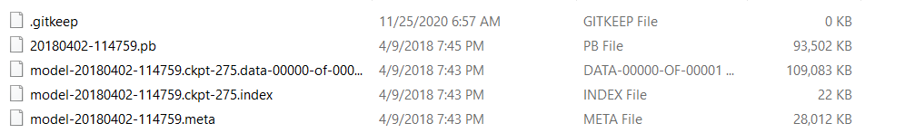

# Attendance-System-Using-MTCNN-and-Facenet

**Face recognition application uses:**
- Multi-task Cascaded Convolutional Networks (MTCNN) to detect faces on image
- Facenet algorithm neural network to build face feature vector
- Euclidean distance (as default) to calculate similarity between two face feature vectors. There is cosine distance verifier in application.
- Below is a use case diagram showing the main functions of the attendance system using MTCNN and Facenet :
  

     
   

### Project requirements

- Python 3.6 or above 
- Compiler that can run Python ( Visual Studio Code, Pycharm,...)
- MySQL Database

### How to run application
1. Install the required libraries in the requirements.txt file
2. Go to the model folder, extract the 2 files model part 1 and model part 2 into a complete model. The result will look like this:

3. Create database in MySQL Workbench for store face information will all columns like this table : 
  

     
   

4. Open all file .py and fix the database name for suitable with the database already create
5. Run file main.py on terminal or compiler
6. The system will display:
  

    
  

- Access to Manage Student if you want to add, delete, edit, add face images for students. (Must have at least 2 faces in the system)
  

      
  

  

    
  

- After collecting the face image, press the Train Data button.
- After training the data, click Check Attendance to recognize faces.
  

      
    

- After the system recognizes the face, the face's information will be automatically saved in the attendance data. Can be checked in the View Attendance section.

    
  

_Copyright 2021 Vi Long._
